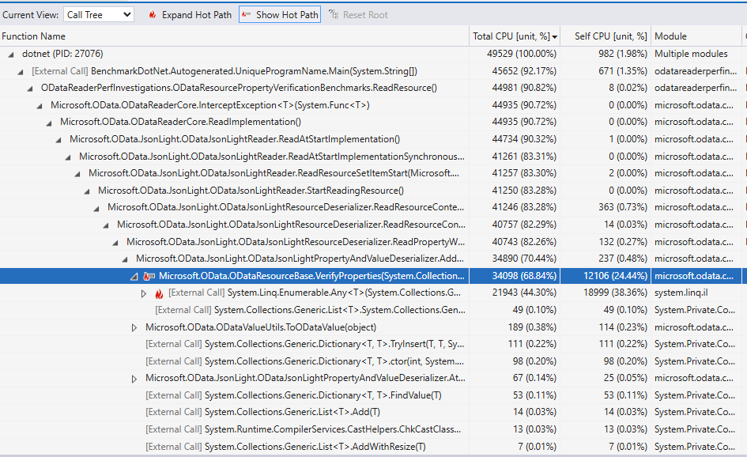

# ODataReader property verification cost

See:
- https://github.com/OData/odata.net/issues/3264
- https://github.com/OData/odata.net/issues/3257
- https://github.com/OData/odata.net/issues/3263

To run the project, you should add a reference to your local copy of the `Microsoft.OData.Core` project.
You can update the path to the OData core project in the [`csproj`](./ODataReaderPerfInvestigations/ODataReaderPerfInvestigations.csproj) 
file and the [solution](./ODataReaderPerfInvestigations.sln) file.

## Benchmark results

### ODL 7.x baseline

```sh
// * Detailed results *
ODataResourcePropertyVerificationBenchmarks.ReadResource: DefaultJob
Runtime = .NET 8.0.17 (8.0.1725.26602), X64 RyuJIT AVX-512F+CD+BW+DQ+VL; GC = Concurrent Workstation
Mean = 23.164 ms, StdErr = 0.132 ms (0.57%), N = 54, StdDev = 0.969 ms
Min = 21.476 ms, Q1 = 22.421 ms, Median = 22.947 ms, Q3 = 23.817 ms, Max = 26.373 ms
IQR = 1.396 ms, LowerFence = 20.327 ms, UpperFence = 25.911 ms
ConfidenceInterval = [22.705 ms; 23.623 ms] (CI 99.9%), Margin = 0.459 ms (1.98% of Mean)
Skewness = 0.93, Kurtosis = 3.97, MValue = 2

-------------------- Histogram --------------------
[21.140 ms ; 21.683 ms) | @
[21.683 ms ; 22.282 ms) | @@@@@@@@
[22.282 ms ; 22.954 ms) | @@@@@@@@@@@@@@@@@@@
[22.954 ms ; 23.906 ms) | @@@@@@@@@@@@@@@@@
[23.906 ms ; 24.663 ms) | @@@@@
[24.663 ms ; 25.218 ms) | @@
[25.218 ms ; 26.037 ms) | @
[26.037 ms ; 26.710 ms) | @
---------------------------------------------------
```

```sh
// * Summary *

BenchmarkDotNet v0.15.1, Windows 11 (10.0.26100.3775/24H2/2024Update/HudsonValley)
Intel Xeon W-2123 CPU 3.60GHz, 1 CPU, 8 logical and 4 physical cores
.NET SDK 10.0.100-preview.1.25120.13
  [Host]     : .NET 8.0.17 (8.0.1725.26602), X64 RyuJIT AVX-512F+CD+BW+DQ+VL
  DefaultJob : .NET 8.0.17 (8.0.1725.26602), X64 RyuJIT AVX-512F+CD+BW+DQ+VL
```


| Method       | Mean     | Error    | StdDev   | Gen0      | Gen1     | Gen2    | Allocated |
|------------- |---------:|---------:|---------:|----------:|---------:|--------:|----------:|
| ReadResource | 23.16 ms | 0.459 ms | 0.969 ms | 2562.5000 | 562.5000 | 62.5000 |  12.65 MB |

``
// * Hints *
Outliers
  ODataResourcePropertyVerificationBenchmarks.ReadResource: Default -> 9 outliers were removed (26.86 ms..40.75 ms)

// * Legends *
  Mean      : Arithmetic mean of all measurements
  Error     : Half of 99.9% confidence interval
  StdDev    : Standard deviation of all measurements
  Gen0      : GC Generation 0 collects per 1000 operations
  Gen1      : GC Generation 1 collects per 1000 operations
  Gen2      : GC Generation 2 collects per 1000 operations
  Allocated : Allocated memory per single operation (managed only, inclusive, 1KB = 1024B)
  1 ms      : 1 Millisecond (0.001 sec)
```

